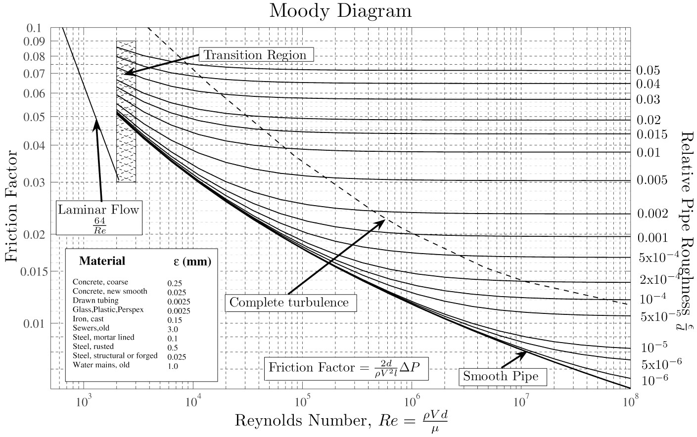

NewtonRaphson
=============
Yet another solver that uses the backslash function to solve a set of
non-linear equations.

Description
-----------
Although this is the most basic non-linear solver, it is surprisingly powerful.
It is based on the Newton-Raphson method in chapter 9.6-7 of Numerical Recipes
in C. In general for well behaved functions and decent initial guesses, its
convergence is at least quadratic. However it may fail if the there are local
minimums, the condition of the Jacobian is poor or the initial guess is
relatively far from the solution. When convergence is negative, it will attempt
to backtrack and line-search. It was validated with fsolve from the MATLAB
[Optimization Toolbox and IPOPT](https://projects.coin-or.org/Ipopt). Please see
the help comments and the example.

Note: LSQ curve-fit type problems can also be solved using newtonraphson. These
are problems where there are many data for a single function, but the
coefficients of the function are unknown. Since there is more data than
unknowns, and the residual is minimized for each data point, the Jacobian is
not square. These problems usually exit with flag 2: "May have converged." and
the solution is the best fit in the "least-squares" sense.

Credit: [Moody diagram is from Wikipedia](http://upload.wikimedia.org/wikipedia/commons/8/80/Moody_diagram.jpg)